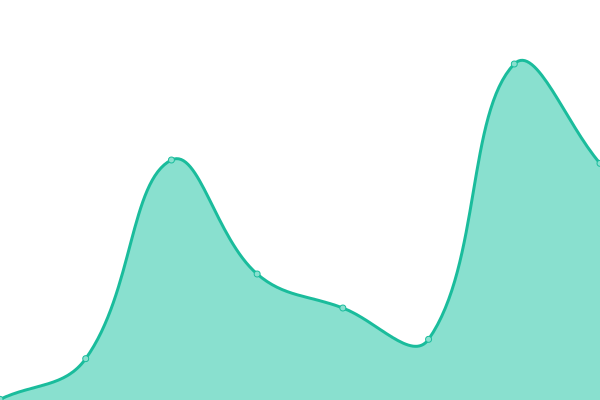

# [📈 Live Status](https://MohamedElashri.github.io/monitor): <!--live status--> **🟧 Partial outage**

This repository contains the open-source uptime monitor and status page for [Mohamed Elashri](https://melashri.net), powered by [Upptime](https://github.com/upptime/upptime).

With [Upptime](https://upptime.js.org), you can get your own unlimited and free uptime monitor and status page, powered entirely by a GitHub repository. We use [Issues](https://github.com/MohamedElashri/monitor/issues) as incident reports, [Actions](https://github.com/MohamedElashri/monitor/actions) as uptime monitors, and [Pages](https://MohamedElashri.github.io/monitor) for the status page.

<!--start: status pages-->
<!-- This summary is generated by Upptime (https://github.com/upptime/upptime) -->
<!-- Do not edit this manually, your changes will be overwritten -->
<!-- prettier-ignore -->
| URL | Status | History | Response Time | Uptime |
| --- | ------ | ------- | ------------- | ------ |
|  [ME Wiki](https://wiki.melashri.me) | 🟩 Up | [me-wiki.yml](https://github.com/MohamedElashri/monitor/commits/HEAD/history/me-wiki.yml) | 

 684ms
     
 | 

<a href="https://MohamedElashri.github.io/monitor/history/me-wiki">100.00%</a>
    

|  [CERN](https://home.cern) | 🟩 Up | [cern.yml](https://github.com/MohamedElashri/monitor/commits/HEAD/history/cern.yml) | 

 1392ms
     
 | 

<a href="https://MohamedElashri.github.io/monitor/history/cern">99.49%</a>
    

|  [LHCb](https://lhcb.web.cern.ch) | 🟩 Up | [lh-cb.yml](https://github.com/MohamedElashri/monitor/commits/HEAD/history/lh-cb.yml) | 

 1008ms
     
 | 

<a href="https://MohamedElashri.github.io/monitor/history/lh-cb">100.00%</a>
    

|  [Fermilab](https://www.fnal.gov) | 🟩 Up | [fermilab.yml](https://github.com/MohamedElashri/monitor/commits/HEAD/history/fermilab.yml) | 

 320ms
     
 | 

<a href="https://MohamedElashri.github.io/monitor/history/fermilab">100.00%</a>
    

|  [Hacker News](https://news.ycombinator.com) | 🟩 Up | [hacker-news.yml](https://github.com/MohamedElashri/monitor/commits/HEAD/history/hacker-news.yml) | 

 352ms
     
 | 

<a href="https://MohamedElashri.github.io/monitor/history/hacker-news">100.00%</a>
    

|  [Mohamed Elashri](https://melashri.net) | 🟩 Up | [mohamed-elashri.yml](https://github.com/MohamedElashri/monitor/commits/HEAD/history/mohamed-elashri.yml) | 

 654ms
     
 | 

<a href="https://MohamedElashri.github.io/monitor/history/mohamed-elashri">100.00%</a>
    

|  [Snibox](https://snip.elashri.xyz) | 🟩 Up | [snibox.yml](https://github.com/MohamedElashri/monitor/commits/HEAD/history/snibox.yml) | 

 669ms
     
 | 

<a href="https://MohamedElashri.github.io/monitor/history/snibox">100.00%</a>
    

|  [UC](https://uc.edu) | 🟩 Up | [uc.yml](https://github.com/MohamedElashri/monitor/commits/HEAD/history/uc.yml) | 

 1003ms
     
 | 

<a href="https://MohamedElashri.github.io/monitor/history/uc">100.00%</a>
    

|  [Adguard Home](https://adguard.elashri.xyz) | 🟩 Up | [adguard-home.yml](https://github.com/MohamedElashri/monitor/commits/HEAD/history/adguard-home.yml) | 

 177ms
     
 | 

<a href="https://MohamedElashri.github.io/monitor/history/adguard-home">100.00%</a>
    

|  [Nextcloud](https://nextcloud.elashri.xyz) | 🟩 Up | [nextcloud.yml](https://github.com/MohamedElashri/monitor/commits/HEAD/history/nextcloud.yml) | 

 1036ms
     
 | 

<a href="https://MohamedElashri.github.io/monitor/history/nextcloud">100.00%</a>
    

|  [My blog](https://blog.melashri.net) | 🟩 Up | [my-blog.yml](https://github.com/MohamedElashri/monitor/commits/HEAD/history/my-blog.yml) | 

 215ms
     
 | 

<a href="https://MohamedElashri.github.io/monitor/history/my-blog">98.73%</a>
    

|  [change-log](https://change.melashri.me) | 🟩 Up | [change-log.yml](https://github.com/MohamedElashri/monitor/commits/HEAD/history/change-log.yml) | 

 347ms
     
 | 

<a href="https://MohamedElashri.github.io/monitor/history/change-log">100.00%</a>
    

|  [Archive](https://archive.elashri.xyz/) | 🟥 Down | [archive.yml](https://github.com/MohamedElashri/monitor/commits/HEAD/history/archive.yml) | 

 476ms
     
 | 

<a href="https://MohamedElashri.github.io/monitor/history/archive">0.00%</a>
    

|  [SearxNG](https://searx.elashri.xyz) | 🟩 Up | [searx-ng.yml](https://github.com/MohamedElashri/monitor/commits/HEAD/history/searx-ng.yml) | 

 568ms
     
 | 

<a href="https://MohamedElashri.github.io/monitor/history/searx-ng">100.00%</a>
    

<!--end: status pages-->

[**Visit our status website →**](https://MohamedElashri.github.io/monitor)

## 📄 License

- Powered by: [Upptime](https://github.com/upptime/upptime)
- Code: [MIT](./LICENSE) © [Mohamed Elashri](https://melashri.net)
- Data in the `./history` directory: [Open Database License](https://opendatacommons.org/licenses/odbl/1-0/)
